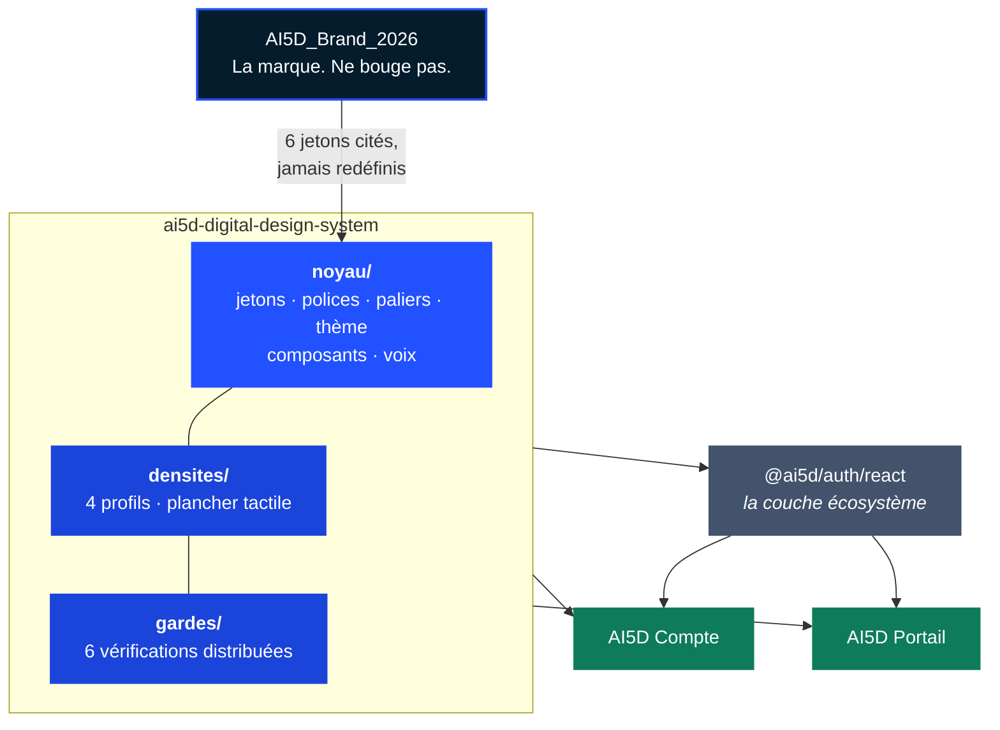

<div align="center">


<br/>


</div>

<br/>

## Le problème

AI5D a une marque, et elle est bonne. Ce qui manquait, c'est la couche entre cette marque et chaque
produit : **ce que la marque accorde à une interface applicative**, par opposition à une page de
communication.

Faute de cette couche, chaque produit re-dérivait la charte du précédent. L'Académie l'a fait la
première, Compte ensuite. Et cette dérivation avait déjà produit des écarts que personne n'avait
décidés. En mesurant les contrastes, on en a trouvé quatre :

<div align="center">

| Jeton                   | Valeur héritée | Contraste réel            | Verdict |
| :---------------------- | :------------- | :------------------------ | :------ |
| Texte secondaire        | `#6B7A85`      | **4,14** sur papier tiède | Échoue  |
| Action en mode sombre   | `#5B7BFF`      | **3,92** sur un menu      | Échoue  |
| Fond de réussite sombre | `#10312A`      | **4,45**                  | Échoue  |
| Vert institutionnel     | `#1E874B`      | **4,25** sur papier tiède | Échoue  |

</div>

Aucun de ces défauts n'était visible à la lecture. Tous étaient en production.

## La solution

Un système de design **consommé**, jamais recopié. Un produit l'installe, choisit sa densité, et ne
décide plus aucune couleur, aucun espacement, aucune coquille.

```ts
import '@ai5d/design-system/preset';
```

```html
<html lang="fr" data-densite="equilibre"></html>
```

## Installation

Le dépôt est **public**, et n'est pas publié sur un registre. On l'installe depuis Git, **épinglé à
une étiquette**, jamais à une branche :

```json
"@ai5d/design-system": "github:Kaaramo/ai5d-digital-design-system#v1.0.1",
"lucide-react": "^1.0.0"
```

puis `pnpm install`, ou directement :

```bash
pnpm add github:Kaaramo/ai5d-digital-design-system#v1.0.1 lucide-react@^1.0.0
```

Vérifié avec pnpm 10.24 : `pnpm add` garde l'étiquette dans le manifeste. Elle doit y rester
visible, pour que la montée de version soit une décision.

**Un produit branché sur les comptes AI5D installe aussi le SDK `@ai5d/auth`, dans la même
commande.** Le guide « Démarrer un nouveau produit AI5D » du
[README du SDK](https://github.com/Kaaramo/ai5d-auth#démarrer-un-nouveau-produit-ai5d) dit quoi
transmettre à l'équipe, la variable à poser, et comment composer `CoquilleRail` avec ses rubriques
et le thème partagé.

**`lucide-react` est une dépendance de pair.** Le système ne l'embarque pas : deux copies de la
bibliothèque d'icônes dans un même produit donneraient deux familles de tracés et un paquet deux
fois plus lourd. Le produit la déclare, en `^1.0.0`.

Le paquet livre du TypeScript et du JSX non transpilés. Sous Next.js :

```ts
// next.config.ts
transpilePackages: ['@ai5d/design-system'],
```

L'épinglage est une règle et non une précaution. Sans lui, une correction de jeton arriverait dans
un produit au prochain `pnpm install`, sans que personne l'ait décidé, et une correction de jeton
change le rendu de tous les écrans.

## Les deux registres

Ce ne sont pas deux marques. C'est une marque et deux problèmes de design : on **visite** un site
trois minutes, on **habite** une application quarante minutes d'affilée.

<div align="center">

|                 | Institutionnel          | Applicatif                           |
| :-------------- | :---------------------- | :----------------------------------- |
| **Où**          | Site, documents, slides | Tous les produits                    |
| **Autorité**    | `AI5D_Brand_2026`       | **Ce dépôt**                         |
| **Angles**      | 0 px partout            | 4 · 10 · 16 px                       |
| **Ombres**      | Aucune, jamais          | Trois niveaux, neutralisés en sombre |
| **Typographie** | Inter seule             | Fraunces · Inter · JetBrains Mono    |
| **Surfaces**    | Blanc pur               | Papier tiède, et mode sombre complet |

</div>

## Les quatre densités

Même palette, mêmes typographies, mêmes composants. Seule varie la densité fonctionnelle.

<div align="center">

| Produit      | Profil      | Rythme | Carte | Contrôle | Pourquoi                            |
| :----------- | :---------- | :----- | :---- | :------- | :---------------------------------- |
| **Académie** | `aere`      | 64 px  | 32 px | 48 px    | Lecture, apprentissage, respiration |
| **Compte**   | `equilibre` | 48 px  | 24 px | 48 px    | Gestion, sécurité, paramètres       |
| **Cercle**   | `modere`    | 40 px  | 20 px | 44 px    | Communauté, interactions, flux      |
| **Lab**      | `compact`   | 32 px  | 16 px | 40 px    | Données, workflows, outils          |

</div>

Deux règles les rendent inoffensives. **La densité change l'espace entre les choses, jamais la
taille du texte**, sans quoi le profil compact devient illisible en six mois. Et **le plancher
tactile de 44 px prime sur les quatre profils**, exprimé une seule fois en requête média.

## Les 34 composants

Neuf familles. Le détail de ce que chacun garantit est dans [`noyau/NOYAU.md`](noyau/NOYAU.md).

<div align="center">

| Famille                | Composants                                                                               |
| :--------------------- | :--------------------------------------------------------------------------------------- |
| **Marque**             | `Logotype` · `Embleme` · `Icone`                                                         |
| **Saisie et action**   | `Bouton` · `Champ`                                                                       |
| **États et signaux**   | `Pastille` · `PastilleEtat` · `Bandeau` · `TempsRelatif` · `Chiffre` · `Avatar`          |
| **Contenu**            | `Carte` · `CarteAction` · `GrilleCartes` · `EnteteRubrique` · `EnteteCarte` · `EtatVide` |
| **Coquilles**          | `CoquilleRail` · `GabaritAuth` · `GabaritApp` · `GabaritSeuil`                           |
| **Navigation**         | `LiensRail` · `BarreOnglets` · `OngletsRubrique` · `SelecteurTheme`                      |
| **Document**           | `GabaritDocument` · `SommaireDocument` · `BlocDocument` · `DeplierDocument`              |
| **Dialogues**          | `BoiteConfirmation` · `BoiteMotif`                                                       |
| **Attente et session** | `Squelette` · `SigneAnime` · `RechargeAuRetour`                                          |

</div>

```tsx
import { CoquilleRail, LiensRail, BarreOnglets } from '@ai5d/design-system/composants';
import { themeOuSysteme, attributTheme } from '@ai5d/design-system/theme';
```

**Le système ne connaît aucun cadriciel.** Aucun composant n'importe Next. La coquille reçoit sa
navigation en emplacements : chaque produit écrit un module client d'une vingtaine de lignes qui lit
son chemin et rend `LiensRail` et `BarreOnglets` avec son propre composant de lien. C'est la seule
pièce de coquille qui reste dans un produit.

Les composants ne dépendent d'aucun framework de style : leurs styles passent par les variables
CSS, si bien qu'un projet sans Tailwind les rend correctement.

## Les gardes

Six vérifications livrées par le système, à brancher dans l'intégration continue de chaque produit.
Elles remplacent la discipline humaine, celle qui a produit les quatre écarts du tableau plus haut.

```ts
import { decrire, verifierAucunEspacementEnDur } from '@ai5d/design-system/gardes';
```

| Garde                                | Ce qu'elle empêche                                                  |
| :----------------------------------- | :------------------------------------------------------------------ |
| `verifierAucuneCouleurEnDur`         | Qu'un écran décide une couleur dans son coin                        |
| `verifierAucunJetonDeMarqueRedefini` | Qu'un produit dérive la marque en surchargeant `--marque-*`         |
| `verifierPlancherTactile`            | Qu'un profil dense casse l'accessibilité tactile                    |
| `verifierAucuneLargeurFixe`          | Qu'une largeur figée empêche une page de descendre sur un téléphone |
| `verifierHauteurDeVueDynamique`      | Qu'un `100vh` se fasse couper par la barre d'adresse mobile         |
| `verifierAucunEspacementEnDur`       | Qu'un espacement en pixels ignore l'échelle et les densités         |

La dernière admet une liste de valeurs **hors échelle**, nommées fichier par fichier : un écart de
2 px qu'aucun jeton n'offre est une décision de dessin, pas une faute. Une valeur que l'échelle
offre, elle, n'a aucune excuse, et une exception qui ne désigne plus rien est refusée.

Le système se les applique d'abord à lui-même. Et le contraste de chaque jeton sémantique est
recalculé à chaque exécution des tests, contre toutes les surfaces où il a le droit d'apparaître.

## Trois règles qui ne se voient pas dans le code

**Le deuxième consommateur.** Un composant monte dans le système quand un deuxième produit en a
besoin, pas avant. `GabaritPortail` a été écrit avant tout usage réel, avec une forme fausse, et
aucun produit ne l'a employé : il a été retiré en `1.0.0`. La coquille à rail qui le remplace est
celle de Compte, montée le jour où AI5D Portail en a demandé une.

**Le fond est peint par le produit.** Le système peint le fond de ses coquilles, pas celui du
`body`. Un produit pose `background: var(--surface-1)` sur son `body`, une fois. Compte l'a appris
à ses dépens, décision 022 : des pages sans coquille restaient sur le blanc du navigateur, et le
texte clair du thème sombre y devenait illisible.

**L'écosystème vit dans le SDK.** Les composants qui lisent la session ou les droits (menu de
compte, sélecteur d'organisation, accès refusé) n'appartiennent pas à ce dépôt. Ils vivent dans
`@ai5d/auth/react`, qui les construit sur les composants d'ici. Voir la décision 004.

## Comment c'est construit



La relation à la marque est **à sens unique**. Le noyau importe les six jetons de marque depuis leur
source institutionnelle et ne les redéfinit jamais. Un test relit la source à chaque exécution et
échoue si la copie a dérivé.

## Commandes du dépôt

```bash
pnpm test          # tests, dont les mesures de contraste et la vérité de cette documentation
pnpm typecheck     # TypeScript strict
pnpm lint          # zéro erreur, zéro avertissement
pnpm format:check  # Prettier

pnpm polices       # récupère les woff2, sous-ensemble latin
pnpm marque        # synchronise les 6 jetons depuis AI5D_Brand_2026
pnpm specimens     # engendre specimens/composants.html
```

Les nombres de tests ne sont pas écrits ici. Ils l'étaient, et ils étaient faux cinq versions plus
tard : un nombre écrit à la main vieillit, un nombre lu vieillit avec son sujet. La version et le
nombre de composants de ce README sont, eux, vérifiés par un test.

<details>
<summary><b>Structure du dépôt</b></summary>

<br/>

```
ai5d-digital-design-system/
├── noyau/
│   ├── NOYAU.md              le document du noyau
│   ├── marque.css            généré : les 6 jetons de marque, préfixés
│   ├── jetons.css            surfaces, texte, sémantiques, typographie, géométrie
│   ├── paliers.css           marges, zones sûres, règles universelles du mobile
│   ├── paliers.ts            les constantes de largeur
│   ├── theme.ts              clair, sombre, système, et le cookie qui les retient
│   ├── ai5d.preset.css       bloc @theme Tailwind v4
│   ├── formulations.md       les formulations de référence
│   ├── polices/              woff2 locaux
│   └── composants/           les composants et leur index
├── densites/                 4 profils, plancher tactile
├── gardes/                   les 6 vérifications distribuées
├── outils/                   contraste WCAG, analyseur de jetons
├── tests/
├── specimens/                la preuve visuelle
├── docs/decisions/           une décision par arbitrage écarté
└── _build/                   polices, synchronisation, spécimens
```

</details>

## Stack

TypeScript strict · React 19 · Tailwind v4 en CSS · Vitest et Testing Library · Lucide en dépendance
de pair · pnpm · Node 24. Les polices sont servies **en local** et jamais depuis un CDN : une page
d'authentification ne doit émettre aucune requête vers un tiers.

## Documents

| Document                                         | Ce qu'il porte                                                             |
| :----------------------------------------------- | :------------------------------------------------------------------------- |
| [`noyau/NOYAU.md`](noyau/NOYAU.md)               | Les jetons et leurs contrastes, la typographie, les 34 composants, la voix |
| [`noyau/PALIERS.md`](noyau/PALIERS.md)           | Mobile d'abord : les paliers, les règles, la coquille d'application        |
| [`noyau/formulations.md`](noyau/formulations.md) | Les formulations de référence                                              |
| [`CHANGELOG.md`](CHANGELOG.md)                   | Une entrée par changement, et le guide de migration vers `1.0.0`           |
| [`docs/decisions/`](docs/decisions/)             | Les arbitrages, avec l'option écartée et pourquoi                          |

## Licence

Tous droits réservés, voir [`LICENSE`](LICENSE). Le dépôt est public pour que les produits et leurs
serveurs de construction l'installent sans jeton ; il n'est pas ouvert à la réutilisation. C'est la
même décision que pour `ai5d-auth`.

---

<div align="center">

<sub>Le registre institutionnel reste sous l'autorité de <code>AI5D_Brand_2026</code>.<br/>
Ce dépôt ne décide que de l'applicatif, et il ne décide rien que la marque lui interdise.</sub>


<sub>© AI5D · ai5d.technology · 2026</sub>

</div>
