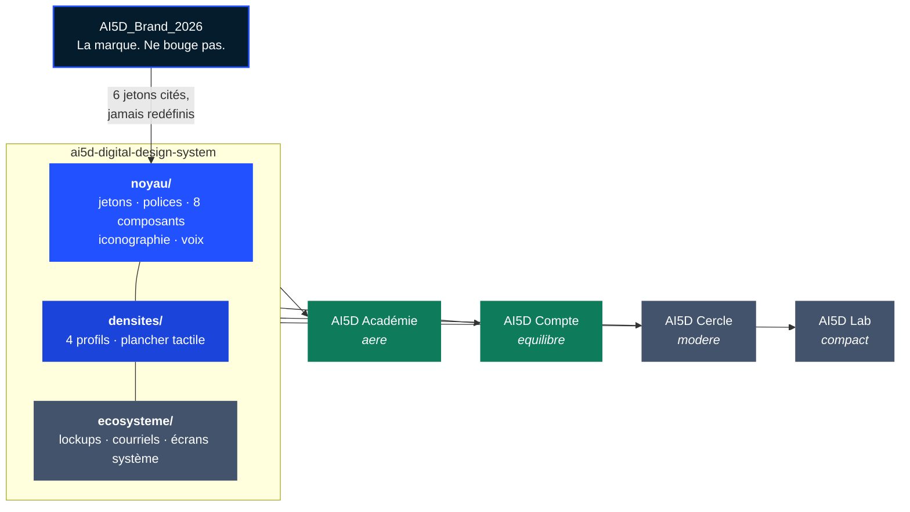

<div align="center">


<br/>


</div>

<br/>

## Le problème

AI5D a une marque, et elle est bonne. Ce qui manquait, c'est la couche entre cette marque
et chaque produit : **le document qui dit une fois pour toutes ce que la marque accorde à
une interface applicative**, par opposition à une page de communication.

Faute de cette couche, chaque produit re-dérivait la charte du précédent en réargumentant
les mêmes décisions pour un usage différent. L'Académie l'a fait la première. Le portail de
compte l'a fait ensuite. Le Cercle et le Lab l'auraient fait à leur tour.

Et cette dérivation avait déjà produit des écarts que personne n'avait décidés. En mesurant
les contrastes, on en a trouvé quatre :

<div align="center">

| Jeton                   | Valeur héritée | Contraste réel            | Verdict |
| :---------------------- | :------------- | :------------------------ | :------ |
| Texte secondaire        | `#6B7A85`      | **4,14** sur papier tiède | Échoue  |
| Action en mode sombre   | `#5B7BFF`      | **3,92** sur un menu      | Échoue  |
| Fond de réussite sombre | `#10312A`      | **4,45**                  | Échoue  |
| Vert institutionnel     | `#1E874B`      | **4,25** sur papier tiède | Échoue  |

</div>

Aucun de ces défauts n'était visible à la lecture. Tous étaient en production.

## La solution

Un système de design **consommé**, jamais recopié. Un produit l'installe, choisit sa
densité, et ne décide plus aucune couleur.

```ts
import '@ai5d/design-system/preset';
```

```html
<html lang="fr" data-densite="equilibre"></html>
```

Deux lignes. C'est toute l'adoption.

## Les deux registres

Ce ne sont pas deux marques. C'est une marque et deux problèmes de design : on **visite**
un site trois minutes en position de jugement, on **habite** une application quarante
minutes d'affilée.

<div align="center">

|                 | Institutionnel          | Applicatif                           |
| :-------------- | :---------------------- | :----------------------------------- |
| **Où**          | Site, documents, slides | Tous les produits                    |
| **Autorité**    | `AI5D_Brand_2026`       | **Ce dépôt**                         |
| **Angles**      | 0 px partout            | 4 · 10 · 16 px                       |
| **Ombres**      | Aucune, jamais          | Trois niveaux, neutralisés en sombre |
| **Typographie** | Inter seule             | Fraunces · Inter · JetBrains Mono    |
| **Surfaces**    | Blanc pur               | Papier tiède, et mode sombre complet |

</div>

## Les quatre densités

Même palette, mêmes typographies, mêmes composants, même langage graphique. Seule varie la
densité fonctionnelle.

<div align="center">

| Produit      | Profil      | Rythme | Carte | Contrôle | Pourquoi                            |
| :----------- | :---------- | :----- | :---- | :------- | :---------------------------------- |
| **Académie** | `aere`      | 64 px  | 32 px | 48 px    | Lecture, apprentissage, respiration |
| **Compte**   | `equilibre` | 48 px  | 24 px | 48 px    | Gestion, sécurité, paramètres       |
| **Cercle**   | `modere`    | 40 px  | 20 px | 44 px    | Communauté, interactions, flux      |
| **Lab**      | `compact`   | 32 px  | 16 px | 40 px    | Données, workflows, outils          |

</div>

Deux règles les rendent inoffensives. **La densité change l'espace entre les choses, jamais
la taille du texte** — sans quoi le profil compact devient illisible en six mois. Et **le
plancher tactile de 44 px prime sur les quatre profils**, exprimé une seule fois en requête
média plutôt qu'écran par écran.

## Comment c'est construit



La relation à la marque est **à sens unique**. Le noyau importe les six jetons de marque
depuis leur source institutionnelle et ne les redéfinit jamais. Un test relit la source à
chaque exécution et échoue si la copie a dérivé.

Les trois couches n'ont pas le même rythme de vie, et c'est la raison du découpage : les
écarts constatés venaient de ce que le noyau et les libertés étaient mélangés dans un même
document. **Quand tout se discute, tout dérive.**

<details>
<summary><b>Ce que porte chaque couche, et à quel rythme elle change</b></summary>

<br/>

| Couche        | Contenu                                                                | Change                                      |
| :------------ | :--------------------------------------------------------------------- | :------------------------------------------ |
| `noyau/`      | Jetons, polices, 8 composants de base, iconographie, voix, mode sombre | Presque jamais. Le toucher est un événement |
| `densites/`   | Quatre profils, un tableau, aucune prose                               | Seulement si un produit s'ajoute            |
| `ecosysteme/` | Lockups produit, composants inter-produits, courriels, écrans système  | Au rythme des produits                      |

Une brique d'écosystème ne se construit **que quand un deuxième produit la demande**. C'est
la règle de gouvernance du dépôt, et elle explique pourquoi cette couche est encore vide.

</details>

## Les gardes

Trois vérifications livrées par le système, exécutées par **chaque projet consommateur**
dans son intégration continue. Elles remplacent la discipline humaine — celle qui a produit
les quatre écarts du tableau plus haut.

```ts
import { decrire, verifierAucuneCouleurEnDur } from '@ai5d/design-system/gardes';
```

| Garde                                | Ce qu'elle empêche                                          |
| :----------------------------------- | :---------------------------------------------------------- |
| `verifierAucuneCouleurEnDur`         | Qu'un écran décide une couleur dans son coin                |
| `verifierAucunJetonDeMarqueRedefini` | Qu'un produit dérive la marque en surchargeant `--marque-*` |
| `verifierPlancherTactile`            | Qu'un profil dense casse l'accessibilité tactile            |

Plus une quatrième, propre au système : **le contraste de chaque jeton sémantique est
recalculé à chaque exécution des tests**, contre toutes les surfaces où il a le droit
d'apparaître, et le build échoue sous 4,5. Quarante-quatre paires, en clair et en sombre. C'est ce
test qui aurait attrapé les quatre défauts des années plus tôt.

## Les huit composants

```tsx
import { CarteAuth, Logotype, Bouton, Champ } from '@ai5d/design-system/composants';
```

<details>
<summary><b>Ce que chacun garantit</b></summary>

<br/>

| Composant   | Garantie                                                                                                                                                             |
| :---------- | :------------------------------------------------------------------------------------------------------------------------------------------------------------------- |
| `Logotype`  | Le « 5 » incliné à -5° et bleu, **dans toutes les variantes**. Interdit de la charte mère : ne jamais le redresser, ne jamais le recolorer. Suit le thème par défaut |
| `Bouton`    | Trois variantes, trois tailles, hauteur pilotée par la densité, plancher tactile respecté, `aria-busy` en chargement                                                 |
| `Champ`     | Libellé **toujours** lié par `htmlFor`, aide et erreur reliées par `aria-describedby`, erreur jamais portée par la seule couleur                                     |
| `Carte`     | Padding piloté par la densité. Rend un `<button>` quand elle est cliquable, jamais une `<div>` avec un gestionnaire de clic                                          |
| `Bandeau`   | Une icône **et** un texte. `role="alert"` pour attention et erreur, `role="status"` pour le reste                                                                    |
| `Pastille`  | Un état compact, qui contient toujours du texte                                                                                                                      |
| `Icone`     | Lucide, contour, épaisseur **1,75**. Décorative par défaut, accessible seulement si on lui donne un titre                                                            |
| `CarteAuth` | Le gabarit d'authentification. Largeur bloquée à **420 px à toutes les tailles**                                                                                     |

Les composants ne dépendent d'aucun framework de style : leurs styles passent par les
variables CSS, si bien qu'un projet sans Tailwind les rend correctement.

</details>

## Installation

Le dépôt est privé et n'est pas publié sur un registre. On l'installe depuis Git,
**épinglé à une étiquette** :

```bash
pnpm add "@ai5d/design-system@github:Kaaramo/ai5d-digital-design-system#v0.1.0"
```

L'épinglage n'est pas une précaution de principe. Sans lui, une correction de jeton
arriverait dans un produit au prochain `pnpm install`, sans que personne ne l'ait décidé —
et une correction de jeton change le rendu de tous les écrans.

Le paquet livre du TypeScript et du JSX non transpilés, pour que le consommateur applique
sa propre cible. Sous Next.js :

```ts
// next.config.ts
transpilePackages: ['@ai5d/design-system'],
```

## Commandes du dépôt

```bash
pnpm test          # 187 tests, dont 44 mesures de contraste
pnpm typecheck     # TypeScript strict, zéro any
pnpm lint          # zéro erreur, zéro avertissement
pnpm format:check  # Prettier

pnpm polices       # récupère les 3 woff2, sous-ensemble latin
pnpm marque        # synchronise les 6 jetons depuis AI5D_Brand_2026
pnpm specimens     # engendre specimens/composants.html
```

<details>
<summary><b>Structure du dépôt</b></summary>

<br/>

```
ai5d-digital-design-system/
├── noyau/
│   ├── NOYAU.md              le document du noyau
│   ├── marque.css            généré — les 6 jetons de marque, préfixés
│   ├── jetons.css            surfaces, texte, sémantiques, typo, géométrie
│   ├── ai5d.preset.css       bloc @theme Tailwind v4
│   ├── formulations.md       le répertoire des formulations de référence
│   ├── polices/              3 woff2 — Fraunces et Inter variables
│   └── composants/           les 8 composants + index
├── densites/
│   ├── DENSITES.md
│   └── profils.css           4 sélecteurs, 6 variables, plancher tactile
├── gardes/                   les 3 vérifications distribuées
├── outils/                   contraste WCAG · analyseur de jetons
├── tests/                    187 tests
├── specimens/                la preuve visuelle, 4 densités × 3 thèmes
├── docs/
│   ├── superpowers/specs/    la spécification
│   ├── superpowers/plans/    le plan d'exécution
│   ├── decisions/            une décision par arbitrage écarté
│   └── preuves/              sorties de commandes et captures
└── _build/                   récupération des polices, synchro, spécimens
```

</details>

## Stack

<div align="center">


</div>

TypeScript strict · React 19 · Tailwind v4 en CSS-first · Vitest et Testing Library ·
Lucide · pnpm · Node 24. Les polices sont servies **en local, en woff2, sous-ensemble
latin** — jamais depuis un CDN : une page d'authentification ne doit émettre aucune requête
vers un tiers.

## État

**Lots 1 à 3 livrés** — noyau, densités, composants, gardes. La couche écosystème attend
ses consommateurs.

<details>
<summary><b>Ce qui reste, et son déclencheur</b></summary>

<br/>

| Lot    | Contenu                                                    | Déclencheur                                              |
| :----- | :--------------------------------------------------------- | :------------------------------------------------------- |
| **L4** | Traçage des 36 SVG de marque, lockups `compte` et `cercle` | Quand un produit aura besoin de son jeu de logos complet |
| **L5** | 5 composants inter-produits, 5 écrans système              | Sprint 03 du portail de compte                           |
| **L6** | Gabarit de courriel transactionnel                         | Sprint 01 du portail de compte                           |
| **L7** | Migration de l'Académie                                    | Après validation des lots 1 à 3                          |

Les 28 SVG de marque qui contiennent du `<text>` dépendent aujourd'hui d'une police
distante : dans un courriel ou un export PDF hors ligne, le wordmark AI5D se rend en Arial.
Le traçage du lot 4 est un livrable, pas un raffinement.

</details>

<details>
<summary><b>Ce qui n'est pas prouvé</b></summary>

<br/>

- L'absence d'appel réseau au chargement n'est vérifiée qu'au niveau du fichier `polices.css`,
  pas dans l'onglet Réseau d'un navigateur.
- Le rendu n'a été vu que sur Chrome, à une seule largeur.
- Les quatre valeurs de densité sont dérivées de la charte Académie par raisonnement, et ne
  sont éprouvées sur aucun écran de produit réel.

Une liste honnête de ce qui reste à prouver vaut mieux qu'une conclusion trop large.

</details>

## Documents

| Document                                         | Ce qu'il porte                                                                    |
| :----------------------------------------------- | :-------------------------------------------------------------------------------- |
| [`noyau/NOYAU.md`](noyau/NOYAU.md)               | Les jetons avec leurs contrastes mesurés, la typographie, les composants, la voix |
| [`densites/DENSITES.md`](densites/DENSITES.md)   | Le tableau et ses deux règles                                                     |
| [`noyau/formulations.md`](noyau/formulations.md) | Les formulations de référence — anti-énumération, verrouillage, accès refusé      |
| [`CHANGELOG.md`](CHANGELOG.md)                   | Une entrée par changement de jeton, avec sa raison                                |
| [`docs/decisions/`](docs/decisions/)             | Les arbitrages, avec l'option écartée et pourquoi                                 |

---

<div align="center">

<sub>Le registre institutionnel reste sous l'autorité de <code>AI5D_Brand_2026</code>.<br/>
Ce dépôt ne décide que de l'applicatif — et il ne décide rien que la marque lui interdise.</sub>


<sub>© AI5D · ai5d.technology · 2026</sub>

</div>
